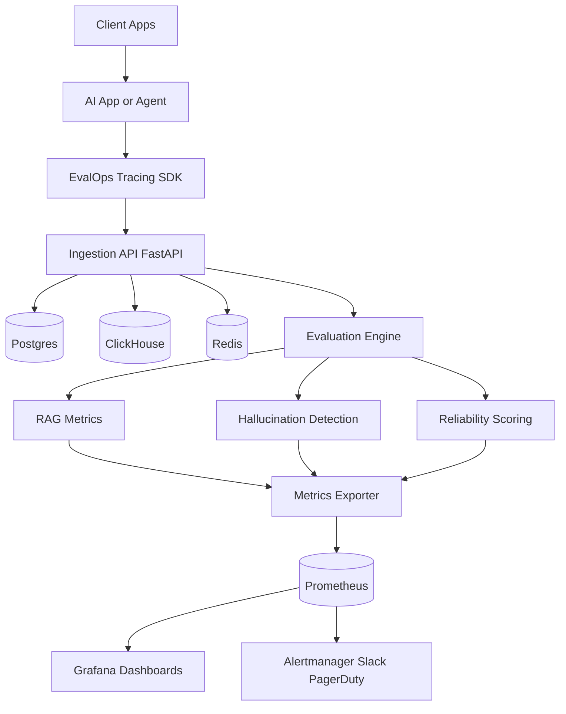

# System Architecture

## Context
EvalOps ingests AI traces, evaluates quality signals, computes reliability, and exposes monitoring surfaces.

## Diagram

## Services
- `backend`: ingestion, evaluation, scoring APIs
- `tracing/python_sdk`: instrumentation package
- `evaluations`: offline and online evaluators
- `frontend`: operator dashboards
- `observability`: Prometheus/Grafana assets
- `infrastructure`: Docker, K8s, Terraform
