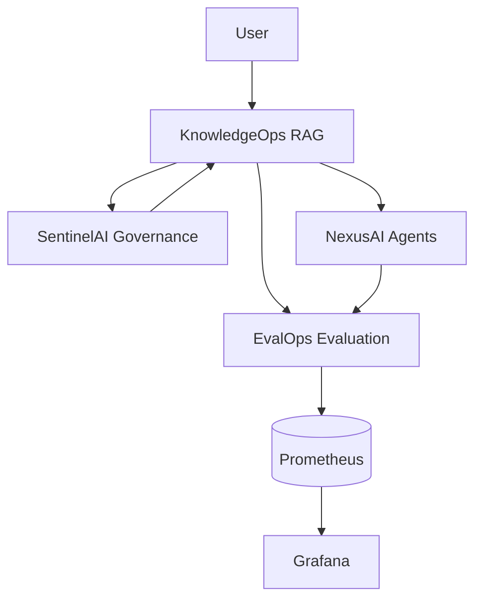
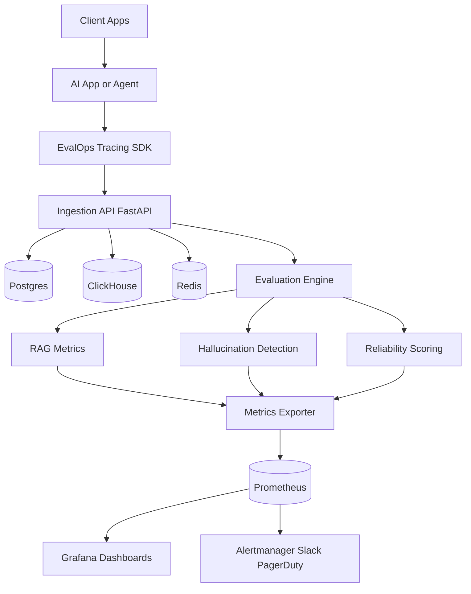

# System Architecture

## Context
EvalOps is the evaluation and observability backbone of the enterprise AI ecosystem. It ingests AI traces, evaluates quality signals, computes reliability, and exposes monitoring surfaces. KnowledgeOps, SentinelAI, and NexusAI all feed evaluation data through EvalOps.

## Ecosystem Architecture

## Diagram

## Services
- `backend`: ingestion, evaluation, scoring APIs
- `tracing/python_sdk`: instrumentation package
- `evaluations`: offline and online evaluators
- `frontend`: operator dashboards
- `observability`: Prometheus/Grafana assets
- `infrastructure`: Docker, K8s, Terraform
